# java-treepanel | Visualization of trees and tree algorithms

In the context of the lecture "Algorithms and Data Structures", trees and algorithms for trees are introduced, among other things. Trees were introduced by the English mathematician Arthur Cayley in 1857 (Cayley, 1857). From the beginning, trees are also represented graphically (Cayley, 1859).

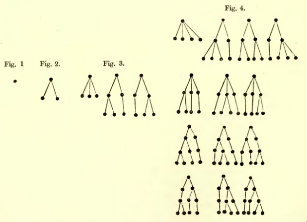

Fig. 1: Representation of trees (Cayley, 1859)

In computer science, trees and tree algorithms have a central role, see e.g. (Wirth, 1975), because their special structure allows hierarchical organizations that can be searched efficiently.

In the lecture "Algorithms and Data Structures" the following variants are presented:

- Heaps: As a basis for the heapsort algorithm and priority queues.

- Binary trees: Simple trees for storing and searching information with a maximum of two successor nodes.

- AVL trees (Georgi Maximovich **A**delson-**V**elsky and Yevgeny Mikhailovich **L**andis, cf: (Adelson-Velsky, et al., 1962)): Binary trees reorganized to the extent that they guarantee search in logarithmic time.

- 2-3-Trees (introduced by John Hopcroft in 1970, see (Aho, et al., 1983)): Trees with two to three successor nodes and with paths of equal length to a data node from the root. The 2-3 trees represent a special case of the B-trees (Bayer, et al., 1972). The B-trees are a basis for the organization of data in computer science (e.g. file systems or databases). They are not discussed further in the lecture, but the transfer from the 2-3 tree is straightforward. (The name "B-tree" is not clear; it may stand for "balanced" or for "Bayer", (Comer, 1979)).

For the presentation in the lecture and for the exercises to the lecture the trees should be visualized. While the visualization can be done manually with paper and pencil (for small trees) comparatively easy, the automatic visualization is difficult. (Rusu, 2014) gives an overview of possible approaches. Classically, mathematics aims at a plane-based representation, where the nodes of a plane all have the same distance from
of the root and nodes of a lower level are below the nodes of a higher level.

Fig. 2 shows a naive implementation based on
Binary tree visualizations from (Aleman-Meza, 2003). This representation is layer-based, but the nodes of a layer overlap.

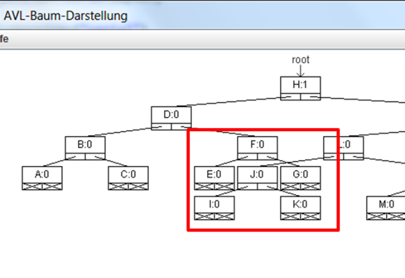

Fig. 2: Incorrect representation of a tree

In the meantime, there are open Java implementations that allow trees to be represented. These implementations are based on the basic algorithm of (Walker, 1989) and (Walker, 1990), which allows a system-independent calculation of the positions (Fig. 3).

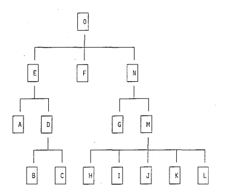

Fig. 3: Example tree according to the algorithm of (Walker, 1989).

An open implementation is e.g. abego TreeLayout, ( (Abego
Software, 2011), see Fig. 4).

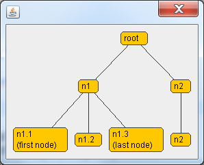

Fig. 4: Example tree (Abego Software, 2011)

While the positioning is correct (and partly optimized), the use of these frameworks requires major adaptations to the algorithms to be represented (e.g. implementation of interfaces, implementation of elementary representation forms, etc.). Since in the lecture the use of the algorithm is to be decoupled as far as possible from the representation, in order to teach the students the essential aspects of the algorithm
I decided to make my own implementation, which is decoupled to the maximum.

The following sections first describe this implementation, and then demonstrate how these components can be used in teaching.

## The TreePanel component

The tree panel component is available as a jar file with sources, javadoc, JUnit test and demo.

### Introduction

The TreePanel component is a subclass of the JPanel and thus can be
like any other Swing components into a graphical
user interface. The component requires two
Parameters:

- An object of the Style type. This object contains the configuration for display, such as spacing of layers, spacing of nodes of a layer, node size, etc. (see below)

- Any object. This object is used as the root of a
Tree structure interpreted. The object is created according to recursive
elements are searched. The root with its recursive elements
is displayed according to the style. The root object can be a POJO
and does not need to provide any special elements. Additionally
recursive elements can be explicitly denoted by annotations.
or excluded and methods for node labeling
(see below). The type of the root object is defined as
type parameter is provided -- this allows the root to also be
can be supplied again by the TreePanel via getter.

Listing 1 defines a simple recursive data structure: a tree with
any number of children. The corresponding UML diagram is shown in Fig. 5
shown.

```java
import java.util.ArrayList;
import java.util.List;

public class Node {
	
	private String label;
	private List<Node> children = new ArrayList<>();

	public Node(String label, Node ... nodes) {
		this.label = label;
		this.add(nodes);
	}
	
	public void add(Node ... nodes){
		for(Node node : nodes)
			children.add(node);
	}

	@Override
	public String toString() {
		return label;
	}
}
```


Listing 1: Definition of a recursive data structure Node

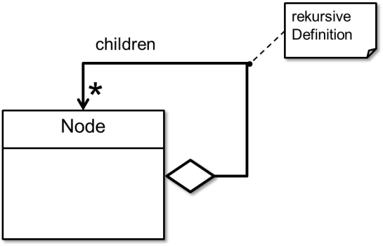

Fig. : UML diagram for the Node class

Listing 2 defines a simple frame that contains an object of class Node
can represent.

```java
import java.awt.Dimension;
import javax.swing.JFrame;

import trees.panel.TreePanel;
import trees.panel.style.Shape;
import trees.panel.style.Style;

public class Displayer extends JFrame{

	public Displayer(Node root){
		super("Sample");

		Style style = new Style(20, 20, 45);
		style.setShape(Shape.ROUNDED_RECTANGLE);
		TreePanel<Node> treePanel = new TreePanel<Node>(style, root);

		this.add(treePanel);
		this.setPreferredSize(new Dimension(325, 200));
		this.setDefaultCloseOperation(JFrame.EXIT_ON_CLOSE);
		this.setLocationByPlatform(true);
		this.pack();
		this.setVisible(true);
	}
}
```
Listing 2: Representation of a tree of type Node

The constructor **new** Style(20, 20, 45) creates a new Style object
with 20 pixels distance between siblings and neighboring trees and 45
pixels distance between two layers. The setter
style.setShape(Shape.*ROUNDED_RECTANGLE*) sets the shape to rectangles
with rounded corners. The constructor **new** TreePanel\<Node>(style,
root) creates a new TreePanel with the specified style and the
root object.

Finally, Listing 3 shows the main class, which creates a tree object
and passes it to the representation class.

```java
public class Main {
	
	public static void main(String[] args) {
				
		Node root = new Node("root", 
				new Node("n1",
						new Node("n1.1\n(first node)"),
						new Node("n1.2"),
						new Node("n1.3\n(last node)")), 
				new Node("n2", 
						new Node("n2.1")),
				new Node("n3"));
		
		new Displayer(root);
	}
}
```

Listing 3: Creating a tree and calling the display

Fig. 6 shows the generated representation (see also Fig. 44 for comparison)

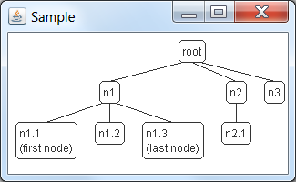

Fig. 6: Visualization of the tree from Listing 1-3

### Detailed description

Fig. 7 shows the package diagram of the TreePanel component with all the
Packages and classes

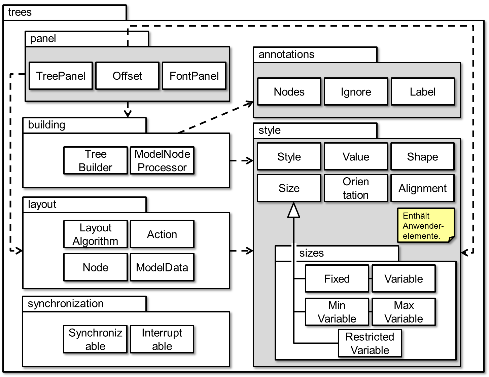

Fig. 7: Package diagram of the TreePanel component with all packages and
Classes. (The packages that contain interfaces for the application,
are grayed out).

For the use of the TreePanel component are the following classes
necessary:

- package trees.panel

	- TreePanel: subclass of JPanel, the actual
Representation component

	- FontPanel: Auxiliary class for easy creation of a font dialog.

	- package trees.style

	- Style: central class for configuring the display; the
the following (simple) classes define the possible values

	- Shape: enumeration type; RECTANGLE or ROUNDED_RECTANGLE

	- Orientation: enumeration type; NORTH (root on top, tree grows towards
down); SOUTH (root down, tree grows up), EAST (root
right, tree grows left); WEST (root left, tree grows
to the right)

	- Alignment: enumeration type; LEFT (tree is on the left margin); RIGHT
(tree is at right edge), TOP (tree is at top edge), BOTTOM
(tree is at the bottom edge), TREE_CENTER (tree is in panel
centered), ROOT_CENTER (root is centered in the panel)

	- Size: abstract class for the definition of fixed or variable
Magnitudes; subclasses for concrete expressions. The subclasses
do not have to be used directly; instead
corresponding static factory methods of Size are used.

- package trees.annotations

	- Nodes: Field annotation that explicitly identifies recursive fields.
-- if the annotation is missing, all recursive fields
used.

	- Ignore: field annotation that explicitly excludes recursive fields.
-- if the annotation is missing, all recursive fields
used.

	- Label: method annotation that explicitly identifies methods that are
Provide node labels -- if the annotation is missing, the
toString method is used.

- package trees.synchronization (_deleted in later version because too complicated_)
	- Interruptable: Abstract class that introduces the capability,
breakpoints in the code. To do this, a class only needs to have these
class as superclass and define the two methods getSenders()
and getReceivers(). The method getSenders() should thereby
provide a list of transmitters that can send an observer over a
change of the tree structure can inform. The method
getReceivers() returns a list of receivers, which are continued
can be.

	- Synchronizable: Abstract class that brings in the ability to write code
to be executed asynchronously. To do this, a class must simply use this class
as a superclass and define the getReceivers() method.

	- The (complex) use of these classes is necessary if a
existing tree algorithm is executed step by step (i.e. always
paused again), without the algorithm being massively
is to be changed. In these cases, at certain points
the method this.breakpoint(String message, Object source)
can be called. This method interrupts the action and waits
to a resume of the graphical user interface. The
Implementation of the 2-3 tree uses this mechanism.

All other classes are for internal support only. The
Algorithm of Walker 1989 is in the class
trees.layout.LayoutAlgorithm implemented. The implementation follows in the
Essentially the account in Walker 1989, in which were
obvious errors corrected. Only significant deviations
were:

- Rename the methods firstWalk and secondWalk to
preliminaryPositioning and finalPositioning

- (Java-related) different initialization of the coordinates for
orientation.

- Calculation of the subtree sizes using the node sizes instead of the
Use of the "meanNodeSize", which leads to unsatisfactory results
led.


## Test and demo

Listing 4 shows a Junit test for the
TreePanel component. The test builds the example tree from Walker, 1989
(see Fig. 3). The quantities were multiplied by 10 to correspond to the
Java coordinate system to be taken into account.

```java
import trees.layout.LayoutAlgorithm;
import trees.layout.ModelData;
import trees.layout.Node;
import trees.style.Style;
import static trees.style.Size.*;

public class TestLayoutAlgorithm {
	private Node a, b, c, d, e, f, g, h, i, j, k, l, m, n, o, root;
	private LayoutAlgorithm algorithm;
	private Style style;
	
	private static class Stub {
		private String label;

		public Stub(String label) {
			this.label = label;
		}

		@Override public String toString() {
			return label;
		}
	}
	
	private Node newNode(String label){
		Stub stub = new Stub(label);
		ModelData model = ModelData.newElement(stub, Stub.class, label, style);
		Node node = new Node(model, style);
		return node;
	}
	
	@Before public void setUp(){
		style = new Style(40, 40, 40, FIXED(20, 20));
		algorithm = new LayoutAlgorithm();
		a = newNode("A"); b = newNode("B"); c = newNode("C");
		d = newNode("D"); e = newNode("E"); f = newNode("F");
		g = newNode("G"); h = newNode("H"); i = newNode("I");
		j = newNode("J"); k = newNode("K"); l = newNode("L");
		m = newNode("M"); n = newNode("N"); o = newNode("O");
		o.add(e, f, n);
		e.add(a, d);
		d.add(b, c);
		n.add(g, m);
		m.add(h, i, j, k, l);
		root = o;
	}
	
	@Test
	public void test1(){
		
		algorithm.positionTree(style, root);
		root.printPostOrder();
				
		assertEquals(0, a.getPrelim()); assertEquals(0, a.getModifier());
		assertEquals(0, a.getX());
		assertEquals(0, b.getPrelim()); assertEquals(0, b.getModifier());
		assertEquals(30, b.getX());
		assertEquals(60, c.getPrelim()); assertEquals(0, c.getModifier());
		assertEquals(90, c.getX());
		assertEquals(60, d.getPrelim()); assertEquals(30, d.getModifier());
		assertEquals(60, d.getX());
		assertEquals(30, e.getPrelim()); assertEquals(0, e.getModifier());
		assertEquals(30, e.getX());
		assertEquals(135, f.getPrelim()); assertEquals(45, f.getModifier());
		assertEquals(135, f.getX());
		assertEquals(0, g.getPrelim()); assertEquals(0, g.getModifier());
		assertEquals(210, g.getX());
		assertEquals(0, h.getPrelim()); assertEquals(0, h.getModifier());
		assertEquals(150, h.getX());
		assertEquals(60, i.getPrelim()); assertEquals(0, i.getModifier());
		assertEquals(210, i.getX());
		assertEquals(120, j.getPrelim()); assertEquals(0, j.getModifier());
		assertEquals(270, j.getX());
		assertEquals(180, k.getPrelim()); assertEquals(0, k.getModifier());
		assertEquals(330, k.getX());
		assertEquals(240, l.getPrelim()); assertEquals(0, l.getModifier());
		assertEquals(390, l.getX());
		assertEquals(60, m.getPrelim()); assertEquals(-60, m.getModifier());
		assertEquals(270, m.getX());
		assertEquals(240, n.getPrelim()); assertEquals(210, n.getModifier());
		assertEquals(240, n.getX());
		assertEquals(135, o.getPrelim()); assertEquals(0, o.getModifier());
		assertEquals(135, o.getX());
	}
}
	
```
Listing 4 JUnit Test for TreePanel


## Use of the TreePanel component in teaching

### Heapsort

Fig. 8 shows the lecture slide on heapsort, Fig. 9 the corresponding
Java visualization, which allows step-by-step viewing of the sorting process.
observe

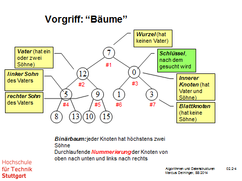

Fig. 8: Lecture slide on the heapsort

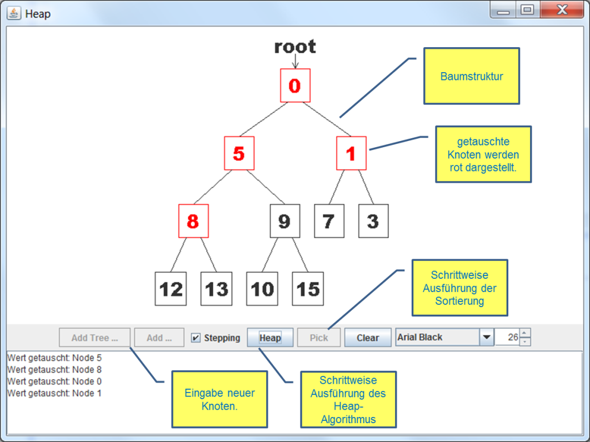

Fig. 9: Heapsort display with TreePanel

### Binary trees

Fig. 10 shows the lecture slide on tree properties. Based on
this definition, students will be given a code framework for a
Binary tree. The code frame allows to create nodes, select and
to delete. Open are the code parts that define the tree properties
determine. These parts are to be completed within the scope of the exercise
can be made. With the help of the test program from Fig. 11, the solution can be
be reviewed.

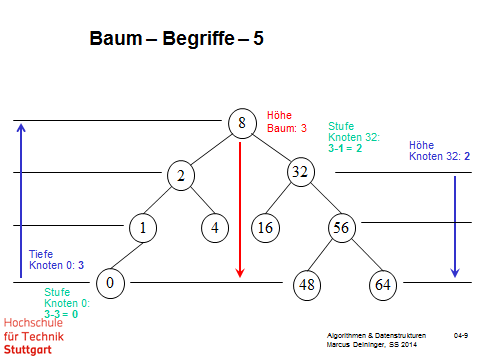

Fig. 10: Lecture slide on tree properties

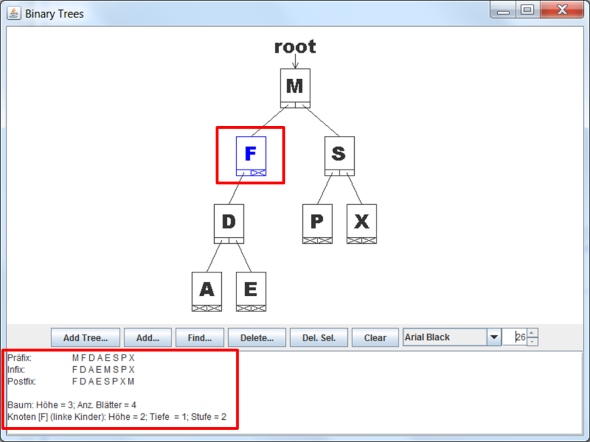

Fig. 11: (Ready-made) exercise program for tree properties

### AVL trees

Fig. 12 shows a lecture slide on AVL trees, which shows the
Reorganization algorithms describes. Based on this definition
students receive a code frame for AVL trees. The code frame
allows to create nodes. Open are the actual
Reorganization steps. These parts are to be developed within the scope of the exercise
can be completed. With the aid of the test program from Fig. 33, the
solution can be checked. In particular, there is the possibility of
Execute substeps of the algorithm in order to understand the operation of the
Algorithm to understand.

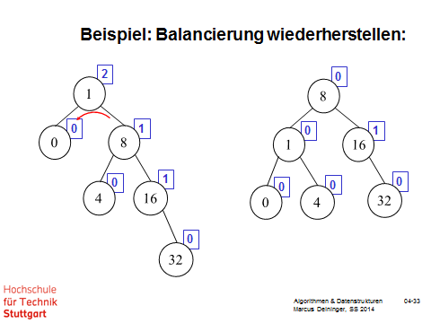

Fig. 12: Lecture slide on AVL trees

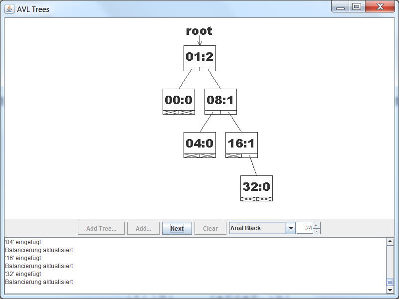

Fig. 13: (Ready-made) exercise program for AVL trees

### 2-3 trees

Fig. 14 shows a lecture slide on 2-3-trees, which shows the
reorganization algorithms. Fig. 15 and Fig. 16 show a
Implementation of these algorithms, which allows the partial steps of the
algorithm in order to understand how it works.

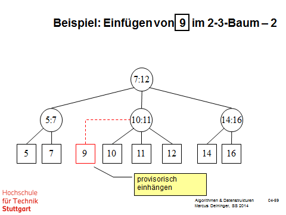

Fig. 14: Lecture slide on 2-3 trees

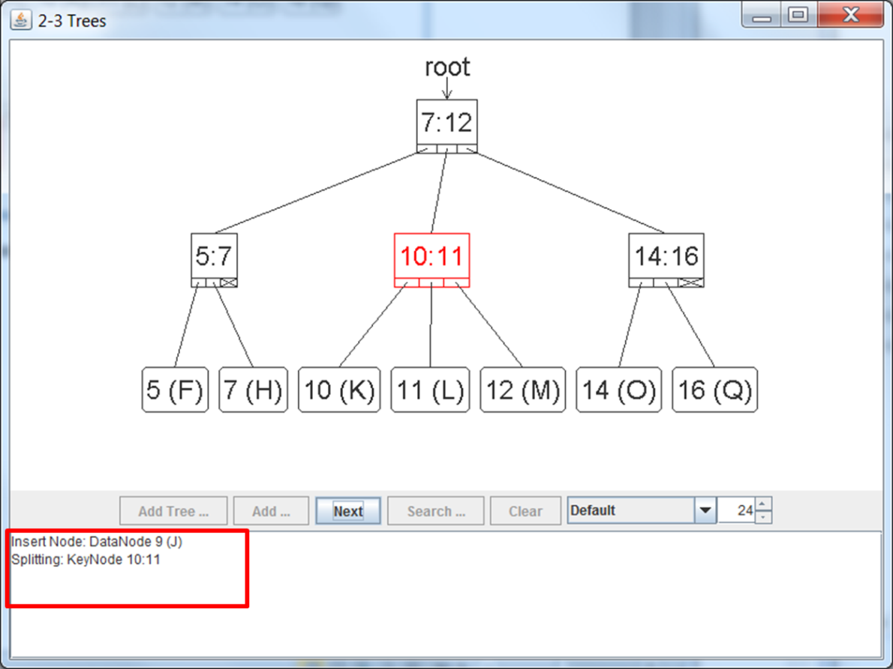

Fig. 15: Display of 2-3 trees with TreePanel

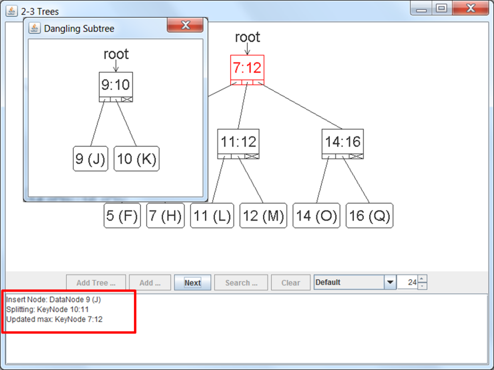

Fig. 16: Display of 2-3 trees with TreePanel

# Literature

**Abego Software. 2011.** treelayout. Efficiently create compact tree
layouts in Java. \[Online\] 2011. https://code.google.com/p/treelayout/
last on 15.2.2015.

**Adelson-Velsky, Georgy Maximovich and Landis, Yevgeny
Mikhailovich. 1962.** An Algorithm for the Organization of Information.
(Translated from the Russian by Myron J. Ricci). *Soviet Mathematics
3.* 1962, S. 1259-1263.

**Aho, Alfred V., Hopcroft, John E., and Ullman, Jeffrey. 1983.** Data
Structures and Algorithms. Boston : Addison-Wesley, 1983.

**Bayer, Rudolf and McCreight, Edward M. 1972.** Organization and
Maintenance of Large Ordered Indexes. *Acta Informatica.* 1972, vol. 1,
S. 173--189.

**Cayley, Arthur. 1857.** *On the Theory of Analytical Forms called.
Trees.* Philosophical Magazine. 1857, vol. 13, pp. 172-176 (Reprint in:
The Collected Mathematical Papers of Arthur Cayley. Volume 3, Cambridge
University Press, Cambridge, 1890, pp. 242-246; digitized at the
Internet Archive: www.archive.org/details/collmathpapers03caylrich).

**Cayley, Arthur. 1859.** *On the Theory of Analytical Forms called Trees. Second
Part.* Philosophical Magazine. 1859, vol. 17, pp. 374-378 (reprint in:
The Collected Mathematical Papers of Arthur Cayley. Volume 4, Cambridge
University Press, Cambridge, 1891, pp. 112-115; digitized at the
Internet Archive: www.archive.org/details/collmathpapers02caylrich).

**Comer, Douglas. 1979.** The Ubiquitous B-Tree. *Computing Surveys.
June 1979, vol. 11, 2, pp. 123--137.

**Rusu, Adrian. 2014.** Tree Drawing Algorithms. \[Book ed.
Tamassia. *Handbook of Graph Drawing and Visualization.* Boca Raton :
CRC Press, 2014, pp. 155-192.

**Walker, John Q. II. 1990.** *A Node-Positioning Algorithm for General
Trees.* Software Practice and Experience. 1990, vol. 20, 7, pp. 685--705.

**Walker, John Q. II. 1989.** *A Node-Positioning Algorithm for General Trees
(TR89-034).* Department of Computer Science, The University of North
Carolina at Chapel Hill. 1989.

**Wirth, Niklaus. 1975.** *Algorithms and data structures.* Stuttgart :
Täubner Publishing House, 1975.

